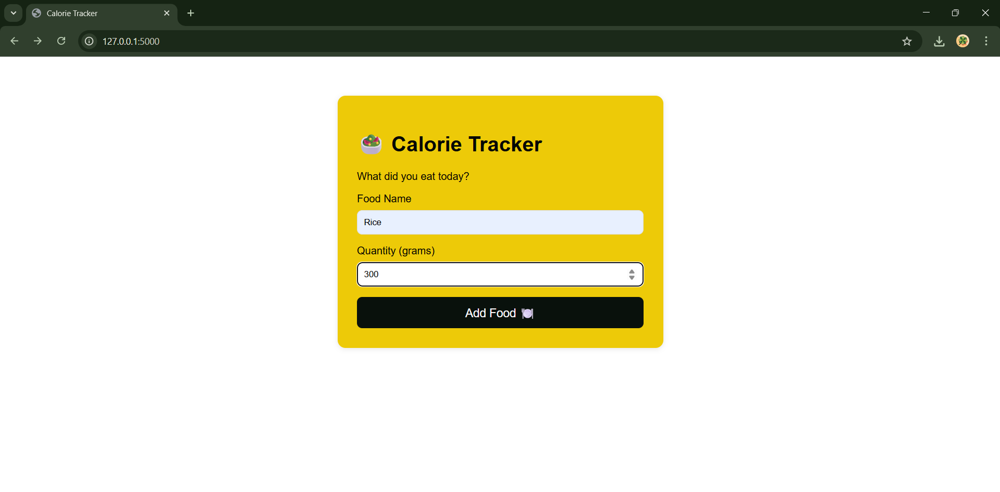
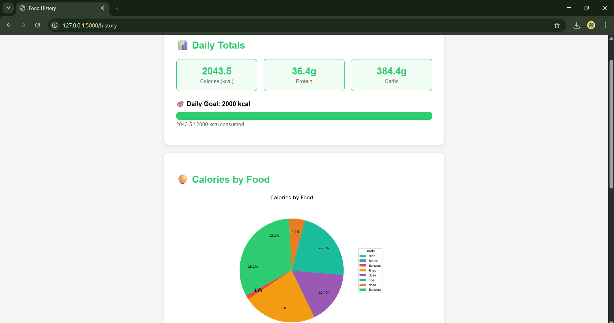
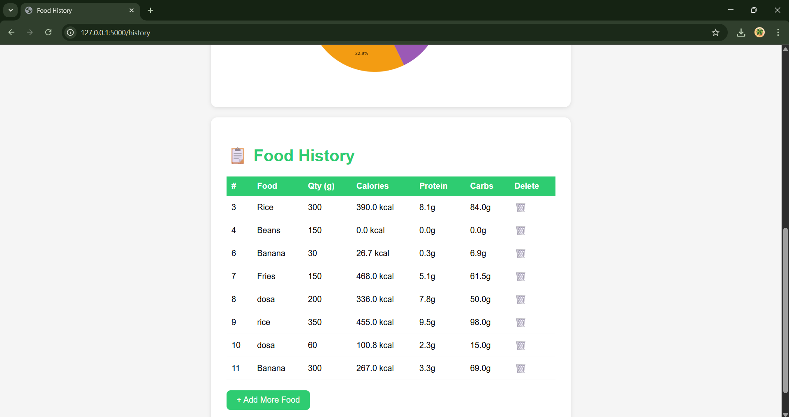

# 🥗 Calorie Tracker

A full-stack web application built with Python and Flask that helps users track their daily food intake and monitor nutritional goals.

## 🌟 Features

- Add food entries with quantity
- Automatic calorie, protein and carbs calculation
- Daily nutrition totals dashboard
- Visual progress bar showing daily calorie goal
- Pie chart showing calories by food
- Delete food entries
- Persistent data storage with SQLite

## 🛠️ Tech Stack

- **Backend:** Python, Flask
- **Database:** SQLite
- **Frontend:** HTML, CSS
- **Charts:** Matplotlib
- **Version Control:** Git & GitHub

## 📸 Screenshots

### Home Page
Add your food intake with name and quantity


### Dashboard
View daily totals, progress bar and pie chart




## 🚀 How to Run Locally

1. Clone the repository
```
   git clone https://github.com/jayashree-swain/calorie-tracker.git
```

2. Navigate to the project folder
```
   cd calorie-tracker
```

3. Create a virtual environment
```
   python -m venv venv
   venv\Scripts\activate
```

4. Install dependencies
```
   pip install flask matplotlib
```

5. Run the app
```
   python app.py
```

6. Open your browser and go to
```
   http://127.0.0.1:5000
```

## 📊 Supported Foods

The app currently supports nutrition data for:
Rice, Chicken, Egg, Banana, Bread, Milk, Apple, Potato, Oats, Dal, Chapati, Paneer, Fish, Pasta, Yogurt and more!

## 🎯 Daily Goal

Default daily calorie goal is set to 2000 kcal with a visual progress bar.

## 👩‍💻 Author

**Jayashree Swain**
- GitHub: [@jayashree-swain](https://github.com/jayashree-swain)

## 📅 Project Timeline

Built as a portfolio project over 4 weeks:
- Week 1: Flask setup and basic app
- Week 2: Nutrition data integration
- Week 3: Charts, progress bar and delete feature
- Week 4: VS Code setup and GitHub deployment